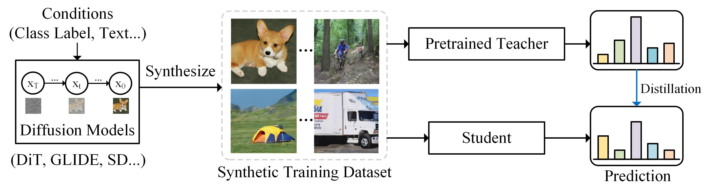

# DM-KD

This is the official implementation of "Is Synthetic Data From Diffusion Models Ready for Knowledge Distillation?"


### Abstract

In this paper, we extensively study whether and how synthetic images produced from state-of-the-art diffusion models can be used for knowledge distillation without access to real images, and obtain three key conclusions: (1) synthetic data from diffusion models can easily lead to state-of-the-art performance among existing synthesis-based distillation methods, (2) low-fidelity synthetic images are better teaching materials, and (3) relatively weak classifiers are better teachers.


### Framework

<div style="text-align:center"></div>

We propose to use the diffusion model to synthesize images given the target label space when
the real dataset is not available. The student model is optimized to minimize the prediction discrepancy between
itself and the teacher model on the synthetic dataset.


### Main Results

On CIFAR-100:

| Method | Syn Method | T:RN-34 <br> S:RN-18 | T:VGG-11 <br> S:RN-18 | T:WRN-40-2 <br> S:WRN-16-1 | T:WRN-40-2 <br> S:WRN-40-1 | T:WRN-40-2 <br> S:WRN-16-2 |
|:---------------:|:-----------------:|:-----------------:|:-----------------:|:------------------:|:------------------:|:--------------------:|
| Teacher <br> Student <br> KD | - <br> - <br> - | 78.05 <br> 77.10 <br> 77.87 | 71.32 <br> 77.10 <br> 75.07| 75.83 <br> 65.31 <br> 64.06 | 75.83 <br> 72.19 <br> 68.58 | 75.83 <br> 73.56 <br> 70.79 |
| DeepInv <br> DAFL <br> DFQ <br> FastDFKD | Inversion <br> Inversion <br> Inversion <br> Inversion | 61.32 <br> 74.47 <br> 77.01 <br> 74.34 | 54.13 <br> 54.16 <br> 66.21 <br> 67.44 | 53.77 <br> 20.88 <br> 51.27 <br> 54.02 | 61.33 <br> 42.83 <br> 54.43 <br> 63.91 | 61.34 <br> 43.70 <br> 64.79 <br> 65.12 |
| One-Image <br> **DM-KD(Ours)** | Augmentation <br> **Diffusion** | 74.56 <br> **76.58** | 68.51 <br> **70.83** | 34.62 <br> **56.29** | 52.39 <br> **65.01** | 54.71 <br> **66.89** |

On ImageNet-1K:

| Method | Syn Method | Data Amount | Epoch | T:RN-50/18 <br> S:RN-50 | T:RN-50/18 <br> S:RN-18|
|:---------------:|:-----------------:|:-----------------:|:-----------------:|:------------------:|:------------------:|
| Place365+KD <br> BigGAN <br> DeepInv <br> FastDFKD | - <br> GAN <br> Inversion <br> Inversion | 1.8M <br> 215K <br> 140K <br> 140K | 200 <br> 90 <br> 90 <br> 200 | 55.74 <br> 64.00 <br> 68.00 <br> 68.61 | 45.53 <br> - <br> - <br> 53.45 |
| One-Image | Augmentation | 1.28M | 200 | 66.20 | - |
| **DM-KD(Ours)** | **Diffusion** | 140K <br> 200K <br> 1.28M | 200 <br> 200 <br> 200 | 66.74 <br> 68.63 <br> **72.43** | 60.10 <br> 61.61 <br> **68.25** |

On other datasets:
| Datasets | Categories <br> (#Classes) | Teacher <br> T:RN-18 | One-Image <br> S:RN-50 | Ours <br> S:RN-50 |
|:---------------:|:-----------------:|:-----------------:|:-----------------:|:------------------:|
| ImageNet-100 | Objects (100)      | 89.6 | 84.4 | **85.9** |
| Flowers-102  | Flower types (102) | 87.9 | 81.5 | **85.4** |

## Running

1. Synthesize data using diffusion models.

In this paper, we use DiT as our default image generator. There are two ways to create synthetic data for distillation.

- You can synthesize your own data according to the [official implementation](https://github.com/facebookresearch/DiT). The DiT model is XL/2. The Image Resolution is 256X256.

After the sythesis is complete, put the synthesized data into the `syn_dataset` folder.

- We provide offline synthesized datasets for experiments.

| Synthetic Dataset | Data Amount | Size | Download1 |
|:---------------:|:-----------------:|:-----------------:|:-----------------:|
| Low Fidelity (s=2, T=100)  | 200K | ~20GB | [[Baidu Yun](https://pan.baidu.com/s/1PjO2Z5eKBthiaQM08u__Jw?pwd=mke3 )] |
| High Fidelity (s=4, T=250) | 200K | ~20GB | [[Baidu Yun](https://pan.baidu.com/s/1ncAi5bxAWMQZckMXjuWUOg?pwd=t5wb)] |

Download the synthesized dataset and put the dataset into the `syn_dataset` folder. Then unzip the dataset in the current folder.

2. Download the true ImageNet validation dataset and put them into the `true_dataset` folder. Then unzip the dataset in the current folder. You can download the true ImageNet-1K dataset using our links ([[Baidu Yun]](https://pan.baidu.com/s/1LCw6YO8mj8fCoy2d1fdsrA?pwd=syyl)). Or you can download the dataset from the [official website](https://www.image-net.org/).

3. Download the pretrained teacher models and put them into the `save/models` folder.

| Teacher models | Download1 |
|:---------------:|:-----------------:|
| ImageNet | [[Baidu Yun](https://pan.baidu.com/s/1HjGlK2lqO2gPG61tz5N20w?pwd=vfpv)] |

Note that the pretrained teacher models are also available at torchvision. You can also download the pretrained models from the [official website](https://pytorch.org/vision/main/models.html).

4. Training on 200K synthesized ImageNet-1K dataset: Run the script: 
```
sh scripts/imagenet_distill.sh
```

The running file will be saved in the `save/student_model` folder.

